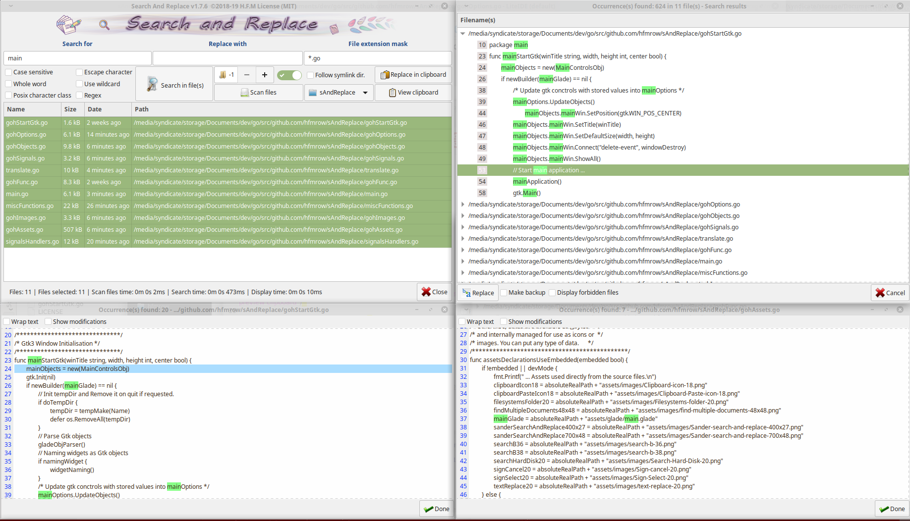

# Search and Replace 1.7.6
*This program is designed to search and replace text pattern in one or multiples files over directory, subdirectory. Search and replace in clipboard allowed. Drag and drop can be used.*

Take a look [here, H.F.M repositories](https://github.com/hfmrow/) for other useful linux softwares.

- If you just want to use it, simply download the compiled version under the "release" tab. You can see at [the Right way to install H.F.M's softwares](https://github.com/hfmrow/instHFMsofts) page to integrate this software in your debian environment.
	
- If you want to play inside code, see below "How to compile" section.

## How it's made
- Programmed with go language: [golang](https://golang.org/doc/) 
- GUI provided by [Gotk3 (gtk3 v3.22)](https://github.com/gotk3/gotk3), GUI library for Go (minimum required v3.16).
- I use home-made software: "Gotk3ObjHandler" to embed images/icons, UI-information and manage/generate gtk3 objects code from [glade ui designer](https://glade.gnome.org/). and "Gotk3ObjTranslate" to generate the language files and the assignment of a tooltip on the gtk3 objects (both are not published at the moment, in fact, they need documentations and, for the moment, I have not had the time to do them).

## Functionalities
- Search and replace text based on pattern (contained in text file(s)).
- Search and replace text pattern into clipboard.
- Allow the displaying of preview with highlighted patterns before modification.
- Wildcard, regex, case sensitive, character classes can be used.
- Whole word functionality, Escape character can be used.
- Drag and drop capacity.
- Files can be sorted by extension or using a mask for filename.
- Backup function available.
- Each function have his tooltip for explanations.

## Some pictures and explanations  

*This is the main screen, and childs*  
  

## How to compile
- Be sure you have golang installed in right way. [Go installation](https://golang.org/doc/install).
- Open terminal window and at command prompt, type: `go get github.com/hfmrow/sAndReplace`
- See [Gotk3 Installation instructions](https://github.com/gotk3/gotk3/wiki#installation) for gui installation instruction.
- To change gtk3 interface you need to use the **devMode = true** to disable embedding assets. see below ...
- To change language file you need to use another home made software, (not published actually). So don't change language file ...
- To Produce a stand-alone executable, you must change inside "main.go" file:

		func main() {
			devMode = true
		...
into

		func main() {
			devMode = false
		...

This operation indicate that externals datas (Image/Icons) must be embedded into the executable file.

### Os information (build using)
| Name       | Version / Info / Name       |
|-----------------|-----------------------------------------------------|
| GOLANG          | V1.13 -> GO111MODULE="off", GOPROXY="direct"        |
| DISTRIB         | LinuxMint                                           |
| VERSION         | 19.1                                                |
| CODENAME        | tessa                                               |
| RELEASE         | #31~18.04.1-Ubuntu SMP Thu Sep 12 18:29:21 UTC 2019 |
| UBUNTU_CODENAME | bionic                                              |
| KERNEL          | 5.0.0-29-generic                                    |
| HDWPLATFORM     | x86_64                                              |
| GTK+ 3          | libgtk-3-0:amd64 3.22.30-1ubuntu3                   |
| GLIB 2          | 2.56.4                                              |
| CAIRO           | 1.15.10                                             |

- The compilation have not been tested under Windows or Mac OS, but all file access functions, line-end manipulations or charset implementation are made with OS portability in mind.

## You got an issue ?
- Give informations (as above), about used platform and OS version.
- Provide a method to reproduce the problem.

## Website
- [H.F.M Linux softwares](https://hfmrow.yo.fr/) Free linux software on Github. Sharing knowledge.
