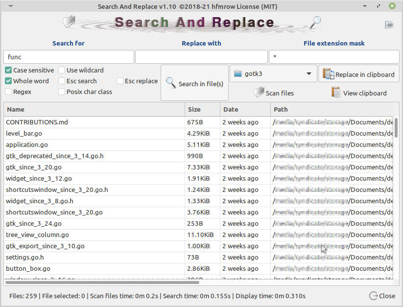
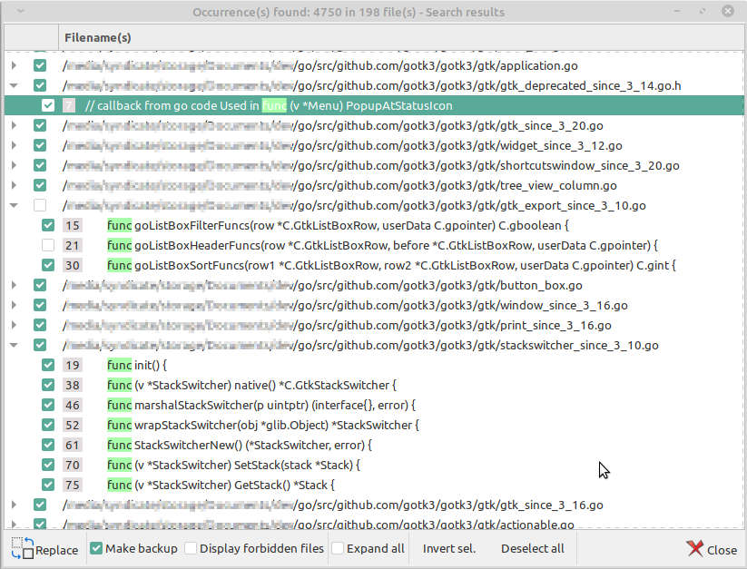
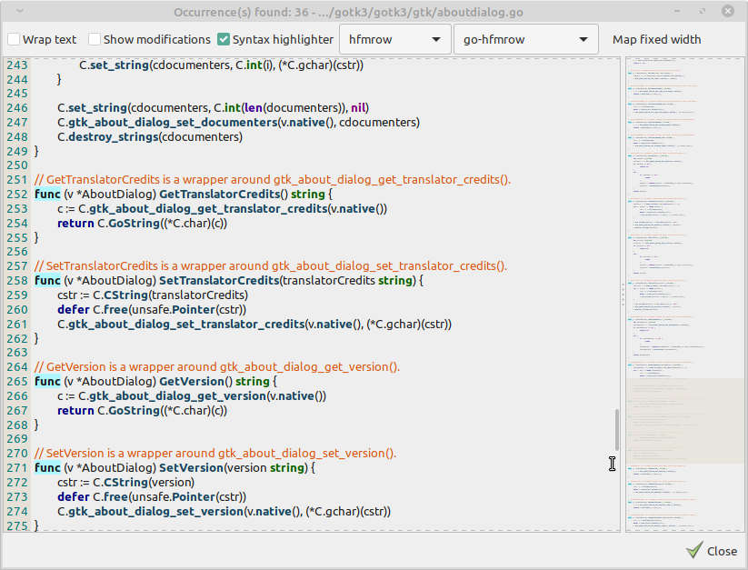

# Search and Replace v1.10

**Note**: since v1.9 '*Search and Replace*' use: [Golang GtkSourceView binding for use with gotk3](https://github.com/hfmrow/gotk3_gtksource)

#### Last update 2021-04-24

*This program is designed to find and replace a text pattern in one or more files stored in one or more directories, sub-directories.
Search and replace in the clipboard is allowed. Drag and drop can be used.
You can use it to search multiple files to find definitions of specific functions in a development environment for example.*

Take a look at [H.F.M repositories](https://github.com/hfmrow/) for others useful Linux software.

- If you just want **to use it**, simply **download** the *.deb package version under the [Releases](https://github.com/hfmrow/search-and-replace/releases) tab. 

- Otherwise, if you plan to play inside the source code, see below "How to compile" section.

- All suggestions, contributions and ideas to improve software usability will be greatly appreciated.

### How it's made

- Programmed with go language: [golang](https://golang.org/doc/)
- GUI provided by [Gotk3](https://github.com/gotk3/gotk3), GUI library for Go (minimum required gtk3.16).
- Text editor use [GtkSourceView](https://github.com/hfmrow/gotk3_gtksource) component.
- I use home-made software: "Gotk3ObjHandler" to embed images/icons, UI-information and manage/generate gtk3 objects code from [glade ui designer](https://glade.gnome.org/). and "Gotk3ObjTranslate" to generate the language files and the assignment of a tool-tip on the gtk3 objects (both are not published at the moment, in fact, they need documentations and, I have not had the time to do them).

### Functionalities

- Search and replace text based on pattern (contained in text file(s)).
- Search and replace text pattern into clipboard.
- A map that allows you to view the content of the text and allows easy navigation through it.
- Allow the displaying of preview with highlighted patterns before modification.
- Source code highlighting for multiple languages with navigation map.
- Wildcard, regex, case sensitive, character classes can be used.
- Whole word functionality, Escape character can be used.
- Drag and drop capacity.
- Files can be sorted by extension or using a mask for filename.
- Lines that contain the searched pattern can be independently selected to be modified or vice versa to keep the content unchanged.
- Options (top right) to filter text files analysis behavior (text detection) and to limit depth of directories where files will be searched.
- Backup function available.
- Each function have his tool-tip for explanations.

###### This is the main screen



###### Found window



###### Preview window



### How to compile

- Be sure you have golang installed in right way. [Go installation](https://golang.org/doc/install).

- Open terminal window and at command prompt, type: `go get github.com/hfmrow/search-and-replace`

- Install [Go bindings for GTK3](https://github.com/gotk3/gotk3) and follow [Installation instructions](https://github.com/gotk3/gotk3/wiki#installation).

- Get [GtkSourceView](https://github.com/hfmrow/gotk3_gtksource) library and follow instructions to install it with his `libgtksourceview-X-dev` package. Required since version 1.9 see at the bottom.

- **Since Go 1.16, native embed library is used instead of previous one and the following restriction is out of date.**

- ~~To change gtk3 interface you need to set `devMode` flag at `true`. A home made software, (not published actually) have been used to generate some parts of source code / assets embedding. So, you cannot (at this time) change interface for production mode.~~

- To change language file you need to use another home made software, (not published actually). You can still do it manually, all data has been stored in a '.json' file in the `assets/lang` directory.

- To Produce a *stand-alone executable*, you must change inside `main.go` file:

```go
    func main() {
        devMode = true
    ...    
```

into

```go
    func main() {
        devMode = false
    ...
```

This operation indicates that the internal behavior of the software will be modified to adapt to the production environment (display of errors, location of the configuration file, etc.).

## Os information:

<details>
  <summary>Built using</summary>

| Name                                                       | Version / Info / Name                          |
| ---------------------------------------------------------- | ---------------------------------------------- |
| GOLANG                                                     | V1.16.3 -> GO111MODULE="off", GOPROXY="direct" |
| DISTRIB                                                    | LinuxMint Xfce                                 |
| VERSION                                                    | 20                                             |
| CODENAME                                                   | ulyana                                         |
| RELEASE                                                    | #46-Ubuntu SMP Fri Jul 10 00:24:02 UTC 2020    |
| UBUNTU_CODENAME                                            | focal                                          |
| KERNEL                                                     | 5.8.0-50-generic                               |
| HDWPLATFORM                                                | x86_64                                         |
| GTK+ 3                                                     | 3.24.20                                        |
| GLIB 2                                                     | 2.64.3                                         |
| CAIRO                                                      | 1.16.0                                         |
| [GtkSourceView](https://github.com/hfmrow/gotk3_gtksource) | 4.6.0                                          |
| [LiteIDE](https://github.com/visualfc/liteide)             | 37.4 qt5.x                                     |
| Qt5                                                        | 5.12.8 in /usr/lib/x86_64-linux-gnu            |

</details>

- The compilation have not been tested under Windows or Mac OS.

### You got an issue ?

- Go to this page: [Issues hfmrow/search-and-replace on GitHub](https://github.com/hfmrow/search-and-replace/issues) and start a new problem report.
- Give the information (as above), concerning your working environment as well as the version of the operating system used.
- Provide a method to reproduce the problem.

### Used libraries

- Since version 1.9: [Golang GtkSourceView binding for use with gotk3](https://github.com/hfmrow/gotk3_gtksource)
- ~~Before version 1.9: [A general purpose syntax highlighter in pure Go](https://github.com/alecthomas/chroma)~~
- [Go Humans! (formatters for units to human friendly time/date)](https://github.com/dustin/go-humanize)
- [Go bindings for GTK3](https://github.com/gotk3/gotk3)
- And some personal libraries not yet published.

### Visit

##### [GitHub repository](https://github.com/hfmrow/SearchAndReplace)

##### [Website H.F.M's Linux softwares](https://hfmrow.go.yo.fr/)
