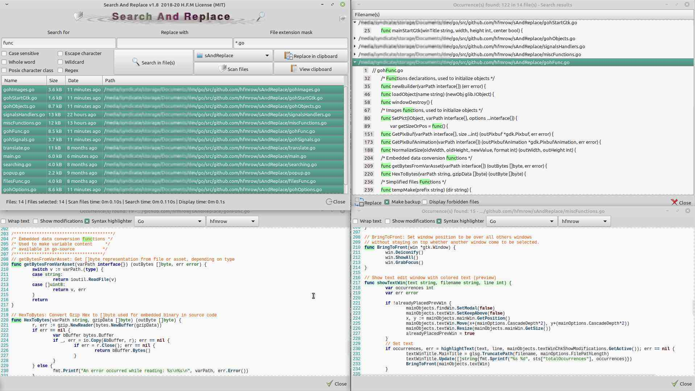

# Search and Replace v1.8

#### Last update 2020-08-06

*This program is designed to find and replace a text pattern in one or more files stored in one or more directories, sub-directories.
Search and replace in the clipboard is allowed. Drag and drop can be used.
You can use it to search multiple files to find definitions of specific functions in a development environment for example.*

Take a look at [H.F.M repositories](https://github.com/hfmrow/) for others useful Linux software.

- If you just want **to use it**, simply **download** the **compiled version** under the [Releases](https://github.com/hfmrow/sAndReplace/releases) tab. You can check at [the Right way to install H.F.M's softwares](https://github.com/hfmrow/instHFMsofts) page to integrate this software in your Debian environment.
  
- **Notice**, ".desktop" file is made to work into the "/opt" directory, if you want to put main folder in an other place, please adjust the ".desktop" file to match the desired directory. Remember, all resources used are embedded in the executable. An ".opt" file is made at the first launch it's used to store used options.
  
- Otherwise, if you plan to play inside the source code, see below "How to compile" section.
  
- All suggestions, contributions and ideas to improve software usability will be greatly appreciated.
  

### How it's made

- Programmed with go language: [golang](https://golang.org/doc/)
- GUI provided by [Gotk3](https://github.com/gotk3/gotk3), GUI library for Go (minimum required v3.16).
- I use home-made software: "Gotk3ObjHandler" to embed images/icons, UI-information and manage/generate gtk3 objects code from [glade ui designer](https://glade.gnome.org/). and "Gotk3ObjTranslate" to generate the language files and the assignment of a tool-tip on the gtk3 objects (both are not published at the moment, in fact, they need documentations and, for the moment, I have not had the time to do them).

### Functionalities

- Search and replace text based on pattern (contained in text file(s)).
- Search and replace text pattern into clipboard.
- Allow the displaying of preview with highlighted patterns before modification.
- Source code highlighting for multiple languages.
- Wildcard, regex, case sensitive, character classes can be used.
- Whole word functionality, Escape character can be used.
- Drag and drop capacity.
- Files can be sorted by extension or using a mask for filename.
- Options (top right) to filter text files analysis behavior (text detection) and to limit depth of directories where files will be searched.
- Backup function available.
- Each function have his tool-tip for explanations.

*This is the main screen, and children*



### How to compile

- Be sure you have golang installed in right way. [Go installation](https://golang.org/doc/install).
  
- Open terminal window and at command prompt, type: `go get github.com/hfmrow/sAndReplace`
  
- See [Gotk3 Installation instructions](https://github.com/gotk3/gotk3/wiki#installation) for gui installation instruction.
  
- To change gtk3 interface you need to use the ```devMode = true``` to disable embedding assets. see below ...
  
- To change language file you need to use another home made software, (not published actually). So don't change language file ...
  
- To Produce a stand-alone executable, you must change inside "main.go" file:
  

```go
    func main() {
        devMode = true
    ...    
```

into

```go
    func main() {
        devMode = false
    ...
```

This operation indicate that externals data (Image/Icons) must be embedded into the executable file.

### Os information (build using)

| Name | Version / Info / Name |
| --- | --- |
| GOLANG | V1.14.6 -> GO111MODULE="off", GOPROXY="direct" |
| DISTRIB | LinuxMint Xfce |
| VERSION | 20  |
| CODENAME | CODENAME=ulyana |
| RELEASE | #46-Ubuntu SMP Fri Jul 10 00:24:02 UTC 2020 |
| UBUNTU_CODENAME | focal |
| KERNEL | 5.4.0-42-generic |
| HDWPLATFORM | x86_64 |
| GTK+ 3 | 3.24.20 |
| GLIB 2 | 2.64.3 |
| CAIRO | 1.16.0 |

- The compilation have not been tested under Windows or Mac OS, but all file access functions, line-end manipulations or charset implementation are made with OS portability in mind.

### You got an issue ?

- Go to this page: [Issues hfmrow/sAndReplace on GitHub](https://github.com/hfmrow/sAndReplace/issues) and start a new problem report.
- Give the information (as above), concerning your working environment as well as the version of the operating system used.
- Provide a method to reproduce the problem.

### Used libraries

- [GitHub - alecthomas/chroma: A general purpose syntax highlighter in pure Go](https://github.com/alecthomas/chroma)
- [GitHub - dustin/go-humanize: Go Humans! (formatters for units to human friendly sizes)](https://github.com/dustin/go-humanize)
- [GitHub - gotk3/gotk3: Go bindings for GTK3](https://github.com/gotk3/gotk3)
- And some personal libraries not yet published.

### Visit

##### [GitHub repository](https://github.com/hfmrow/sAndReplace)

##### [Website H.F.M's Linux softwares](https://hfmrow.go.yo.fr/)
